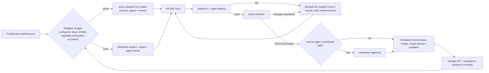

# MeshCore One → Android port plan

## 1. Problem and approach

MeshCore One is a Swift/SwiftUI iOS app (protocol library `MeshCore`, service layer `MC1Services`,
UI app `MC1`, widgets `MC1Widgets`, `Shared`) that talks to MeshCore LoRa companion radios over BLE or WiFi.
The reference snapshot is `db14559b39d32322b06477c6ae676112f583db50`: approximately 150K production
Swift lines in 1,060 files, plus 468 test/support files and the generated localization file.
Goal: a full-parity native Android app on the newest platform (Android 17 / API 37), built by a fleet of
specialized Copilot agents. A deterministic manifest and dispatcher drive the agents, and CI enforces the gates.

The approach is a **behavior-faithful port with file-level accountability**. Every in-scope Swift file is
mapped to tested Android behavior or a reviewed platform adaptation. Many-to-many mappings are allowed:
Swift extensions may become one Kotlin class, and a Swift platform service may need multiple Android adapters.
File counts and headers are traceability, not proof of parity. The Swift tree stays as the read-only specification.
The active work is split into **64 work packages (WPs)**, and each WP is owned by one of **17 agents**. WPs are dispatched
to the GitHub Copilot cloud agent or local sessions once their dependencies are verified and merged. They
auto-merge when CI and an independent parity review pass, except for human-gated WPs and protected paths.

**Current scope:** 64 WPs and 178 dependency edges form an acyclic graph; the 17 agent profiles
and three skill drafts have been checked against the roster and documented configuration format.
The user authorized programming once the review was complete. Begin WP-000 in one dedicated worktree
session; the drafts are not yet installed. This approval is not activation of the full fleet,
authorization to change repository settings or evidence for signing/hardware gates.

## 2. Confirmed decisions

| Topic | Decision |
|---|---|
| Technology | Native Kotlin + Jetpack Compose (Material 3). Pure-Kotlin protocol module. |
| Repo layout | New `android/` Gradle project alongside the Swift code. Swift is the read-only reference. |
| SDK levels | `minSdk 31` (Android 12), `targetSdk`/`compileSdk 37` (Android 17) |
| Automation | One agent set in `.github/agents/`, dispatchable to the **cloud** (issue assignment) **or locally** (Copilot app worktree sessions / headless `copilot` CLI) |
| Reservation model | **Automatic typed capability bookkeeping, not repeated permission.** Assignment authorizes ordinary work inside manifest capabilities; trusted rules admit directly necessary support paths and invariants, while unknown capabilities fail closed. |
| Merge policy | **Full auto-merge** when CI and the parity review pass, except for human-gated WPs and protected paths |
| Distribution | Sideloaded APK via **GitHub Releases only**. No Play Store and no billing; **all themes unlocked**. |
| applicationId | `com.meshcoreone.android` (debug: `com.meshcoreone.android.debug`). Kotlin root package `com.meshcoreone.android` |
| Google services | Allowed for **optional features**; BLE/WiFi mesh messaging, persistence and core navigation must not require Google Play services. |
| Message translation | Removed from active scope by explicit user decision; not deferred, implemented, or required for any future build/release. Re-admission requires a new user feature request and scope/admission decision. App localization remains in scope. |
| Backup compatibility | **Bidirectional iOS/Android compatibility**, verified against the existing iOS backup codec and restore behavior. |
| Licensing | Preserve the GPLv3 app license and MIT MeshCore notices. Every linked dependency, model and distributed asset must be license-compatible. Optional Google SDKs are not automatically approved. |

Implementation candidates (recorded as ADRs in WP-001; the human reviews them at that gate):
- Manual DI with a process-lifetime `AppContainer` and a per-radio-connection `RadioSessionContainer`,
  instead of Hilt. The latter mirrors the actual `ServiceContainer` lifetime, construction and teardown.
- Nordic Android-BLE-Library (BSD-3) behind a facade that mirrors `BLEStateMachine`. A spike in WP-205 confirms this.
- No new accounts, backend, telemetry collection, automatic APK installation or billing system.

## 2.1 WP-000 policy amendment: capability reservations are not permissions

This amendment supersedes the model where authorization prose and all-write-path leases became repeated per-file permission. An assigned WP/session authorizes ordinary implementation, tests, evidence, generated outputs and directly necessary support edits inside manifest-declared capabilities. A trusted rule must map each path and operation to a capability and its invariants; unknown or outside-capability work fails closed. Protected-path and maintainer approval remain merge-to-main gates, not repeated permission for already-admitted local work.

The operative contract is:

- Assignment is the authorization; a reservation is automatic concurrency bookkeeping that binds identities, revisions, capability IDs, operations and actual paths.
- Initial acquisition and same-owner scope evolution are performed by the worker/coordinator before edits. They never require a user to restate permission or supply exact future checksum, fixture, annotation or generated-output bytes.
- Shared surfaces use typed capabilities for dependency metadata, App support, traceability validators, generated resources, schemas and workflows. Definitions state operations, invariants and required validation.
- Disjoint semantic edits use automatic transaction/merge reconciliation. Real semantic overlap serializes or transfers to the current producer. Only an unresolved ownership collision, drift, protected/human gate, missing authentication/tool capability or substantive product decision escalates.
- Authorization prose remains immutable audit context. Implementation evidence, not authorization text, binds changed bytes and test outcomes.
- A discovered support path is admitted only when a trusted path-and-operation rule maps it to an assigned capability; otherwise one actionable blocker fails closed.
- Existing WP-218 and WP-302 work continues without pause or path surrender. Protected merge gates, exact-head/current-base validation, one WP/branch/PR, pinned Swift source and real parity evidence remain unchanged.
- Historical authorization strings and actual identities/bindings are preserved while versioned capability state is added transactionally and idempotently without release/recreate.

ADR-006 defines the migration algorithm and measurable WP-003 regression suite, including App3 transfer, validator2 handoff, annotation plus 37-POM evolution, same-path disjoint merge, stale CAS, third-party/controller collision, protected path, wrong capability and unchanged actual identities/bindings. This WP-000 layer changes policy only; dispatch remains paused until separately activated.

Verification is selected from the changed surfaces. Full repository verification
is reserved for broad or unclassifiable Android changes, dependency/toolchain or
build-graph changes, release candidates, and explicit maintainer requests.
Ordinary candidates use targeted jobs plus hosted integration coverage. Verified
caches, task reuse, and parallel workers are permitted, but cache warmth is not
correctness evidence; strict dependency locks, checksums, pinned coordinates, and
verification metadata remain mandatory.
The exact-candidate hosted job result and log are authoritative for reproducible
automated checks; the repository does not persist or revalidate duplicate CI
result bundles. Non-reproducible hardware/device, signing, release, human and
legal evidence remains retained.

## 2.2 WP-000 scope amendment: remove message translation

User decision (verbatim): "Change the scope, translation is uneeded for now unless someone requests the feature. Remove it from the current plan. Do not make it a requirement for future builds."

WP-406 is retired from the active DAG, not completed or deferred. Its five prerequisites and its
two incoming dependency edges (WP-407 and WP-505) are removed; the remaining seven human gates and
all protected-path, hardware, signing, license and positive-discovery requirements are unchanged.
The original 65-WP/185-edge/eight-gate catalog and historical evidence remain audit history.
The deterministic [scope amendment](scope-amendments/translation-removal.json) preserves the entire
predecessor catalog, source pin and original blob identities through exact reversible changes.

The 26 translation-only sources, tests and helper are explicitly `removed-translation` in
`not-ported.json`, accountable to WP-000 for this user-approved scope exclusion, never fake ports or
Apple-only glue. Their original test cases/parameter families remain inventoried in the historical
WP-004 catalog; exclusion is not a passing test or feature acceptance. Mixed chat/room/settings,
localization, backup, message-text and rendering inputs stay owned. Preserve stored/original text,
clipboard/reply/resend/reaction/preview behavior and all non-translation messaging.

No translation engine/model/provider is implemented, downloaded or linked. Existing inert scaffold
module/contract/rendering helpers may remain for compatibility; they provide no translation success,
entry point or release requirement. WP-407 must not register a translation placeholder or treat the
absent feature/provider as a completion blocker. Adding translation again requires a new user request
and scope/admission decision, including then-applicable license/privacy/runtime review.

## 3. Target architecture

### 3.1 Tech stack
WP-001 verifies a mutually compatible stable toolchain; WP-002 pins it in the wrapper and version catalog.
Do not independently choose "latest" for every component or copy unverified version numbers from search results.
The candidate JDK 21 / Kotlin 2.x / AGP 9.x / Gradle 9.x combination must compile and run on Windows and Linux.

| Area | Choice |
|---|---|
| Language/build | Kotlin 2.x (K2), JDK 21 toolchain, AGP 9.x, Gradle 9.x, version catalog, `build-logic` convention plugins, KSP |
| UI | Compose BOM, Material 3, M3 Adaptive (`NavigationSuiteScaffold`, `ListDetailPaneScaffold`), Navigation 3 |
| State/concurrency | ViewModel + StateFlow, coroutines/Flow. Serialized dispatcher views for actor-like state; explicit queues/locks where operations must remain atomic across suspension. |
| Persistence | Room (KSP, schema export, migration tests), DataStore (Preferences), Android Keystore (AES-GCM) |
| BLE | Platform GATT + Nordic Android-BLE-Library facade; CompanionDeviceManager; `connectedDevice` foreground service (FGS) |
| Network | OkHttp, Jsoup (link previews), kotlinx.serialization (backup JSON), coroutine sockets (WiFi transport) |
| Crypto | JCA (SHA-256, HMAC, AES/ECB/NoPadding) + BouncyCastle lightweight API (X25519, Ed25519) |
| Maps/charts/media | MapLibre Native Android (16 KB-page compatible), Vico charts, Coil 3, CameraX + ZXing, androidx emoji2 picker |
| System | Glance widgets, TileService, ShortcutManagerCompat, share targets, SplashScreen, per-app language. AppFunctions is an optional future extension while its Jetpack integration remains alpha. |
| Quality | JUnit 5 (JVM modules), Robolectric, Turbine, Compose UI test, Roborazzi screenshots, Kover, ktlint, detekt, Android Lint, AboutLibraries |

### 3.2 Module layout (`android/`)
```
android/
├─ app/                    :app — Application, MainActivity, AppContainer wiring, manifest, nav host
├─ build-logic/convention/ convention plugins (jvm-lib, android-lib, compose, feature, room, app, quality)
├─ core/
│  ├─ protocol/            pure Kotlin/JVM, MIT (mirrors MeshCore Swift package)
│  ├─ model/               pure Kotlin domain models + DTOs (MC1Services/Models, DTOs)
│  ├─ contracts/           typed service/repository/transport factories and navigation identifiers
│  ├─ database/            Room entities/DAOs/migrations (SwiftData @Model types)
│  ├─ datastore/           DataStore prefs + Keystore secrets
│  ├─ data/                PersistenceStore repositories, backup/restore
│  ├─ ble/                 BLE transport + state machine
│  ├─ connectivity/        CDM pairing, permissions, FGS, presence/reconnect, WiFi network binding
│  ├─ runtime/             connection lifecycle and per-connection scope, using injected factories
│  ├─ services/            MC1Services domain services, sync, RF, simulator
│  ├─ designsystem/        10 themes, tokens, typography, icons
│  ├─ ui/                  shared composables, tips
│  ├─ maps/                shared MapLibre composables (map tab, LoS, node location)
│  ├─ l10n/                generated strings/plurals for 12 languages
│  └─ testing/             fakes, fixtures, golden vectors, AppContainer.forTesting()
├─ feature/  onboarding · chats · nodes · remotenodes · map · tools · settings
├─ platform/ notifications · widgets · shortcuts
├─ tools/meshcli/          JVM CLI harness for talking to a real radio over TCP (dev only)
└─ benchmark/              baseline profiles + macrobenchmarks
```
Dependency rules:
- `core:protocol` has no Android dependencies.
- `core:model` may depend on protocol value types; `core:contracts` depends only on model/protocol,
  never on concrete services, database, connectivity or UI.
- Database/DataStore/data, BLE/connectivity, runtime, services and platform adapters implement these contracts.
  Services consume injected connection signals, not the concrete runtime; runtime consumes an injected
  session-service factory, not concrete services. The application composes them.
- Features depend only on `core:*`, never on other features. `:app` wires the navigation.
- Test helpers may depend on production modules, but production modules never depend on `core:testing`.
- Packages follow `com.meshcoreone.android.<group>.<module>`.
- Check tracked source paths against `.gitignore`; do not confuse generated `build/` output with source packages.
  Tooling lives in `tools/android-port/`, not the ignored `scripts/` directory.

### 3.2a Lifetimes and early contracts
WP-001 defines the API boundaries; WP-201 implements domain/repository contracts after protocol primitives.
WP-207 implements connection lifecycle against factories, without prematurely constructing services that
belong to WPs 208-218. WP-303 assembles the complete graph only after those services exist.

- Process lifetime: Room database, preferences/secrets, connection controller and platform notification adapter.
- Connection lifetime: transport/session, radio-partitioned service graph, event monitoring, ACK waiters,
  send-queue drains and sync scopes. A reconnect creates a new generation; stale callbacks are rejected.
- Screen lifetime: ViewModels and UI collectors; leaving a screen must not stop the connected radio.
- Teardown finishes event streams, cancels owned scopes, flushes buffers and closes GATT/sockets exactly once.
- Scaffold feature entry points compile and clearly show "not yet ported" where necessary. Such placeholders
  are never counted as feature completion and must be absent from the feature-complete/release artifact.

### 3.3 iOS → Android platform mapping
| iOS | Android | WP |
|---|---|---|
| SwiftUI, NavigationStack, iPad split view | Compose M3, Navigation 3 per-tab back stacks, list-detail panes on width ≥600dp | 301–302 |
| `@Observable` / `@MainActor` AppState | ViewModels + StateFlow state holders | 303 |
| actors / async-await / AsyncStream | confined classes, coroutines, Channel/SharedFlow/StateFlow | all |
| SwiftData | Room | 201–202 |
| UserDefaults/@AppStorage, Keychain | DataStore, Keystore AES-GCM | 204 |
| CoreBluetooth (Nordic UART Service, NUS) | BluetoothGatt + Nordic library facade | 205 |
| AccessorySetupKit, background BLE / state restoration | CompanionDeviceManager, presence APIs and one connection-owning `connectedDevice` FGS, with capability/API-level fallbacks | 206 |
| Network.framework WiFi TCP | JVM coroutine sockets + `ACCESS_LOCAL_NETWORK` + WiFi network binding | 108, 206 |
| CryptoKit / CommonCrypto | JCA + BouncyCastle lightweight | 102 |
| MapKit + MapLibre iOS, offline maps, snapshots | MapLibre Android, OfflineManager, MapSnapshotter | 312 |
| Swift Charts | Vico | 313, 315, 316 |
| ActivityKit Live Activity | Ongoing connection notification plus widget/tile; Live Update promotion only for a qualifying user-initiated, time-sensitive activity | 402 |
| WidgetKit + Control widget | Glance widget + Quick Settings tile | 403 |
| AppIntents / Shortcuts | App Shortcuts and share target; no release dependency on alpha AppFunctions | 404 |
| UserNotifications | channels, MessagingStyle, RemoteInput direct reply, conversation shortcuts | 401 |
| `meshcore://` URL scheme | intent-filter deep links | 405 |
| TipKit | `:core:ui` show-once tips (DataStore) | 304 |
| Translation / NaturalLanguage | User-approved message-translation scope exclusion; app localization and original message text are preserved | removed |
| VisionKit QR / CoreImage QR | CameraX + ZXing | 311 |
| LinkPresentation + scraping + urlhaus filter | OkHttp + Jsoup port + bundled host list | 218 |
| StoreKit (theme IAP, tips) | **removed**. Themes unlocked; support screen has links only. | 318 |
| SwiftGen L10n, asset-catalog colorsets | generated `strings.xml` + key map, generated Compose color schemes | 005, 301 |
| os.Logger + PersistentLogger / DebugLogBuffer | logger facade + Room-persisted buffer (flush 5 s / 50 entries; keep 7 days / 50K) | 212 |
| MessagingUI timeline, Emojibase | custom reversed `LazyColumn`, emoji2 picker | 307, 308 |
| Settings.bundle acknowledgements | AboutLibraries licenses screen | 318 |

### 3.4 Android 17/16 requirements checklist (WP-407 audits them)
- **Display and navigation:** edge-to-edge is enforced, predictive back is on by default, and on displays ≥600dp orientation and resizability locks are ignored. The app must be adaptive at every size.
- **Local network:** request `ACCESS_LOCAL_NETWORK` when required by API 37. Permission denial must
  disable LAN connection attempts explicitly without disabling BLE or offline access to existing data.
- **Bluetooth:** `BLUETOOTH_CONNECT`, plus `BLUETOOTH_SCAN` with `neverForLocation` for the non-CDM fallback. Location isn't required for BLE.
- **Notifications and FGS:** API-gate `POST_NOTIFICATIONS` (33+) and type-specific FGS permissions (34+).
  Declare the appropriate companion permissions for background-start exemptions; association alone is not
  a blanket exemption. CDM does not create GATT connections, its pairing UI can require Location Services,
  and capability/rotating-address limitations need a direct-scan fallback.
- **Lifecycle:** exercise denied/revoked permissions, Bluetooth off/on, no-internet WiFi, process death,
  reboot before first unlock, OEM battery restrictions and deliberate force-stop. Do not promise guaranteed
  reconnect after force-stop or run a periodic WorkManager loop as a live-radio service.
- **Widgets:** a hard memory limit applies to bitmaps in `RemoteViews` (Android 17); exceeding it crashes the app.
- **Network security:** Certificate Transparency defaults and ECH support vary with networking library/server.
  Report preview failures without weakening TLS globally; protect redirects, private network targets and size limits.
- **Activity security:** use non-exported components and immutable explicit PendingIntents by default.
  Direct reply needs its specifically mutable PendingIntent. No blanket background-activity-launch opt-in.
- **Runtime:** reflection on `static final` fields is banned, and `MessageQueue` is now lock-free. Avoid hidden APIs such as `BluetoothGatt.refresh()`.
- **Native libraries:** 16 KB page-size alignment.
- **System integration:** per-app language through `localeConfig`, a themed monochrome icon, and backup and data-extraction rules that exclude secrets.

### 3.5 Review corrections incorporated
- **Protocol ordering:** event payloads require LPP. WP-106 now follows WP-105 and precedes WP-103;
  parsers must not compile against event types that have not been ported.
- **Service graph:** WP-207 is lifecycle infrastructure, not a prematurely complete `ServiceContainer`.
  WP-303 is the integration milestone after sync, notification policy, rendering and demo services exist.
- **Backup facts:** envelope v1 uses **seconds since 1970**, Codable binary data encoding and zlib.
  Existing limits are 50 MiB compressed and 512 MiB expanded. Preserve them with bounded/streamed reads,
  canonical UUID/byte handling and both-direction codec tests; do not assume Swift's default 2001 date epoch.
- **Message translation:** the earlier restoration to required scope is superseded by section 2.2.
  No translation engine/model or absent-feature gate is part of active build/release acceptance.
- **Live Activity:** persistent radio status is not automatically eligible for a promoted Live Update.
- **Automation:** bootstrap is paused, all required checks run for PR and merge-group SHAs, and closed
  issues or model-written PASS text are never sufficient evidence to merge or unlock dependencies.

## 4. Agent system

### 4.1 Roster
Agent definition drafts are in the session folder (`../../.github/agents/*.agent.md`). WP-000 installs them to
`.github/agents/`. Every agent follows the shared skills `android-port-wp`, `swift-to-kotlin` and, for UI work,
`compose-from-swiftui` (drafts are in `../../.github/skills/`).

| # | Agent | Section owned | Work packages |
|---|---|---|---|
| 1 | `port-orchestrator` | Dispatch, triage, WP splitting, status reporting (never writes product code) | 000 |
| 2 | `android-architect` | ADRs, module boundaries, cross-module contracts, platform mapping | 001 |
| 3 | `android-build-engineer` | Gradle, CI, cloud-agent environment, performance/R8, signed releases | 002, 003, 504, 506 |
| 4 | `test-parity-engineer` | Test infrastructure, golden vectors, parity audits, UI/screenshot suites, HIL kit | 004, 109, 501, 502, 505 |
| 5 | `localization-engineer` | `.strings`/`.stringsdict` → Android resources pipeline, 12 languages | 005 |
| 6 | `upstream-sync` | Sync from `Avi0n/MeshCoreOne`, file-level re-port issues | 006 (+ weekly) |
| 7 | `protocol-porter` | `MeshCore` → `:core:protocol`, byte-exact | 101–108 |
| 8 | `data-persistence-engineer` | Models/DTOs, Room, DataStore, Keystore, backup | 201–204 |
| 9 | `connectivity-engineer` | BLE, CDM pairing, permissions, FGS, reconnect, WiFi glue | 205, 206 |
| 10 | `services-porter` | `MC1Services` services/sync/RF/simulator, app state, app-level services | 207–218, 303 |
| 11 | `design-system-engineer` | Themes, components, app shell, adaptive nav, accessibility | 301, 302, 304, 503 |
| 12 | `chats-ui-engineer` | Chats tab | 306–310 |
| 13 | `nodes-map-ui-engineer` | Nodes tab, remote node admin, map, path editing | 311–313 |
| 14 | `tools-ui-engineer` | Tools tab (trace path, LoS, discovery, CLI, RX log, noise floor) | 314–316 |
| 15 | `settings-onboarding-ui-engineer` | Onboarding, settings, appearance, backup UI, about | 305, 317, 318 |
| 16 | `platform-integrations-engineer` | Notifications, Live Updates, widget, QS tile, shortcuts, deep links, polish | 401–407 |
| 17 | `parity-reviewer` | Read-only reviewer of every port PR; emits PASS / CHANGES_REQUESTED | all PRs |

### 4.2 Shared automation assets (created in WP-000)
- **`.github/copilot-instructions.md`.** Covers the read-only Swift reference, Android layout, license policy,
  offline-core requirement, explicit errors and one-WP/one-branch/one-PR execution.
- **`.github/instructions/`.** `android.instructions.md` (`applyTo: android/**`) and `swift-reference.instructions.md` (Swift directories are read-only for port work).
- **`.github/skills/`.** `android-port-wp` (WP protocol, definition of done, PR format), `swift-to-kotlin` (idioms and gotchas) and `compose-from-swiftui`.
- **`docs/android/`.** Contains:
  - `PORTING_PLAN.md`
  - `port-manifest.json`, the canonical machine-readable WPs: owner, dependencies, source/test/resource
    ownership, cross-references, `write_paths`, acceptance, verification tasks and `human_gate`
  - `not-ported.json`, reviewed exclusions (billing, generated Swift artifacts and Apple-only glue),
    with reasons and Android adaptations where appropriate
  - `AUTOMATION.md`, covering setup, the pause switch and the loop
  - `adr/`, `deviations/WP-xxx.md` (one file per WP, so there are no merge conflicts) and `generated/` (status, parity, l10n key map, icon map)
- **Traceability.** Ported production/test Kotlin files carry one or more
  `// PortedFrom: <git-relative source path>@<reference commit>` headers. Android-only files declare
  `// AndroidOnly: WP-xxx <reason>`. Generated files point to their generator inputs. Tooling supports
  many-to-many mappings and derives reports without parallel agents editing a shared progress document.
- **Coverage invariant.** Every source, test and user-facing resource is assigned exactly one primary owner
  or an explicit reviewed exclusion. Reading another WP's source is allowed; writing its paths is not.
  Feature acceptance, not a header or closed issue, determines completion.
- **Manifest expansion in WP-000.** Resolve the reference tree into explicit paths, including errors,
  extensions, app-level utilities, localization/plurals, widget strings, icons, styles and license notices.
  Reject unowned files, duplicate owners, empty globs, unresolved dependencies and cycles. New upstream
  files become unassigned blockers until a reviewed owner is recorded.
- **`tools/android-port/`** (Python; not `scripts/`, which `.gitignore` excludes):
  - `controller/dispatch.py` with `status`, `files`, `render`, `sync-issues`, `claim`, `release`,
    `cloud`, `local` and `report`; dry-run by default
  - `controller/validate.py` (schema, DAG, ownership, source hashes, path locks and gate-integrity)
  - `portmap.py`
  - Added by later WPs: `l10n_convert.py`, `theme_convert.py`, `extract_vectors.py`, `test_inventory.py`, `resync.py` and `hil/`
- **Issue/PR conventions.** `.github/ISSUE_TEMPLATE/android-port-wp.yml`, Android-specific test evidence in
  the PR template, and CODEOWNERS for workflows, agent/policy files, trusted controller, manifest/ADRs,
  build/dependency/signing configuration and oracle/golden-vector policy. Owner review is enforced by a
  trusted conditional approval check; do not accidentally require a human review on every ordinary WP.
- **Workflows:**
  - `android-port-dispatch.yml` uses the trusted default-branch manifest/controller and a serialized
    claim ledger. It can sync issues, then assign verified-ready WPs with the matching custom agent.
  - `android-parity-review.yml` stages the trusted reviewer profile, reference, candidate diff and CI
    evidence. The reviewer has **read/search tools only**, not shell/edit/network tools. A separate
    controller validates its structured output and posts `parity-review` for the exact candidate SHA.
  - `android-pr-shepherd.yml` routes CI/conflict/review feedback to the **existing** local session or
    cloud task, for at most three repair rounds per WP attempt. Afterwards it blocks on `needs-human`.
    Only a completed task may be marked ready; never infer completion from inactivity or a draft flag.
  - `android-gate-integrity.yml` uses trusted base policy to detect protected paths, removed WPs,
    weakened acceptance/gates and missing current-head maintainer approval.
  - `copilot-setup-steps.yml` has the required single `copilot-setup-steps` job: read-only checkout,
    supported Ubuntu x64 runner, pinned JDK/Android SDK/Python and validated Gradle preparation.
    It must be merged to the default branch before cloud use. A failed setup does not itself stop Copilot,
    so workers also run an explicit environment-readiness check.
  - `android-ci.yml` (WP-003) adds always-reported required checks and conditional module jobs; it must
    handle `pull_request` and `merge_group`, not workflow-level path filters that leave required checks pending.
  - `android-upstream-sync.yml` (WP-006) and `android-release.yml` (WP-506) are enabled separately at their gates.

**Bootstrap sequence:** WPs 000-003 are explicitly supervised. WP-000 installs drafts and a paused,
dry-run controller; WP-001 approves contracts; WP-002 produces a buildable scaffold; WP-003 proves the
required checks and approval rules. Only then may the user configure limits and enable automatic dispatch.

### 4.3 Work-package lifecycle


### 4.4 Dispatch modes
1. **Cloud.** Render one WP prompt and assign the existing WP issue using the documented issues REST API:
   both `assignees: ["copilot-swe-agent[bot]"]` and `agent_assignment` with the custom agent are required
   by the current documentation. Verify account/repo availability and the custom-agent identifier at
   bootstrap; do not use the newer agent-tasks API as though it necessarily accepts custom-agent selection.
   User-to-server authentication is required; a workflow installation token is not a substitute.
2. **Local, Copilot app.** An app orchestrator records the automatic typed reservation, then uses native `create_session`
   with a worktree, `kickoff.agent=<owner>`, a complete rendered prompt and `notify_on_idle`.
   A Python script or GitHub workflow cannot call app-native tools directly. The app surface is an
   adapter available only when the coordinating session exposes those tools.
3. **Local, headless.** With explicit permission, the local adapter records the same reservation and uses a
   dedicated `.worktrees/WP-xxx` worktree and `copilot --agent <owner> -p <prompt>`.
   Use bounded tool/path permissions, not blanket `--allow-all` or unrestricted credential inheritance.
   Use native issue/PR tools when the host provides them; otherwise the supported `gh` interface.

All three modes share the same rendered prompt and limits:
- **Off by default:** `ANDROID_PORT_DISPATCH_MODE=off`, `ANDROID_PORT_PAUSED=true`.
- **Limits:** the user must set `ANDROID_PORT_MAX_INFLIGHT` and a supported usage/budget policy before
  enabling dispatch. Missing limits block launch; do not invent an AI-credit ceiling or launch 17 roles at once.
  Models inherit the user's defaults unless explicitly selected.
- **Capability admission:** assignment covers ordinary work in manifest capabilities. Trusted path+operation
  rules automatically admit directly necessary shared support work and its invariants; unmatched work fails
  closed with one actionable blocker.
- **Reservation/idempotency:** one serialized controller records typed reservations for both backends.
  Same-owner evolution is automatic. Disjoint semantic edits reconcile transactionally; real overlap
  serializes or transfers to the current producer. Record WP, base/ref, source/manifest hashes, capability
  IDs, actual paths, backend and task/session/PR identity before any repeat dispatch.
  A restart reconciles live work instead of launching duplicates; uncertain state blocks for inspection.
- **Pause:** blocks new dispatch, repair launches and merges without terminating running workers.
- **Completion:** only a merged implementation PR plus verified acceptance closes a WP for dependency
  purposes. A manually closed issue, model summary or idle session is not success.

### 4.5 Merge and quality gates
- **Required checks:** `android-ci` (debug build, unit tests, lint, detekt, ktlint, coverage policy,
  l10n sync, manifest/traceability and license evidence), `parity-review`, and `gate-integrity`.
  Each reports for every required PR/merge-group candidate, including infrastructure-only changes.
  Zero discovered tests, missing evidence, skipped required checks or unavailable reviewer fail closed.
- **Merge strategy:** this is a public personal-account repository and auto-merge is currently disabled.
  Do not assume organization-only merge-queue availability. Default to a single merge controller that
  updates/rechecks one candidate against current `main`, revalidates the exact head and merges without
  bypassing branch protection. If a native queue is available, re-run all required checks/review against its SHA.
- **SHA binding:** review/evidence records include repository, base SHA, head SHA, WP, manifest/policy
  revision and CI run identifiers. Pushes, rebases or base changes invalidate stale approvals/verdicts.
- **Human-gated WPs:**
  - WP-000 (bootstrap)
  - WP-001 (ADRs)
  - WP-002 (toolchain/build scaffold)
  - WP-003 (CI/gates)
  - WP-006 (upstream sync)
  - WP-505 (hardware-in-the-loop)
  - WP-506 (signing/release)
  - Any PR that touches a protected policy/build/signing/oracle path
  - Any PR labeled `needs-human`
- **Trust separation:** build/test jobs execute candidate code on ephemeral runners with read-only tokens,
  no persisted checkout credentials, no signing/dispatch secrets and no privileged shared runner.
  Privileged controller workflows execute **trusted default-branch code only**, validate artifact schemas
  and SHA provenance, and never execute a PR artifact/script through `pull_request_target` or `workflow_run`.
- **Reviewer separation:** profile/policy come from the trusted base, not the candidate's agent files.
  PR text/comments are untrusted data. Malformed or missing verdicts block. The reviewer does not publish
  its own check, approve protected-path changes, run tests or substitute for hardware/license evidence.
- **Signing separation:** a protected release environment receives signing credentials only after the
  release gate. Ordinary agents and candidate CI never receive them.

## 5. Work packages
These are macro work packages, not promises that an entire subsystem fits one agent context.
The installed manifest expands exact source/test/resource ownership in WP-000. If a WP is too large,
split it into small child WPs with bounded acceptance and dependencies in a human-reviewed manifest
amendment before dispatch. The primary owner remains responsible for complete feature coverage.
The tables show main sources only; related errors, extensions, helpers and tests must also be assigned.

### Phase 0: Foundation and automation
| ID | Work package | Agent | Depends on | Gate |
|---|---|---|---|---|
| WP-000 | Install 17 agent/3 skill drafts, instructions, source ownership manifest, trusted controller and dry-run tests; automation stays paused | port-orchestrator | none | Human |
| WP-001 | Approve compatible toolchain, acyclic module map, lifetimes, typed factory/repository/UI contracts, license candidates and platform adaptations | android-architect | 000 | Human |
| WP-002 | Buildable Gradle scaffold: catalog, convention plugins, contracts/module shells, stable feature entry points and Android ignores | android-build-engineer | 001 | Human |
| WP-003 | Prove required PR/merge checks, conditional human approval, isolated CI, cloud readiness and debug APK artifact; enable dispatch only by separate user action | android-build-engineer | 002 | Human |
| WP-004 | JVM/Android test stack, fakes, source test inventory, pinned golden vectors and Swift/macOS codec-oracle harness | test-parity-engineer | 003 | |
| WP-005 | L10n converter (12 languages plus widget strings, plurals and argument types), key map, locale fallback and CI drift checks | localization-engineer | 003 | |
| WP-006 | Upstream sync workflow + `resync.py` (changed Swift files → owner re-port issues via `PortedFrom` SHAs) | upstream-sync | 003 | Human |

### Phase 1: Protocol (`:core:protocol`, from `MeshCore/Sources/MeshCore`)
| ID | Work package | Agent | Depends on |
|---|---|---|---|
| WP-101 | Byte reader/writer, SHA-256/name derivation helper, constants/value models, session configuration values and `MeshTransport` contract | protocol-porter | 003, 004 |
| WP-102 | Crypto: SHA-256, truncated HMAC, AES-128-ECB, X25519/Ed25519 + Ed→X conversion, signing | protocol-porter | 101 |
| WP-103 | Response/push parsers (`Protocol/`) returning the already-defined event/payload vocabulary | protocol-porter | 101, 106 |
| WP-104 | Command builders (PacketBuilder) | protocol-porter | 101 |
| WP-105 | Cayenne LPP (`LPP/`) | protocol-porter | 101 |
| WP-106 | Event/payload vocabulary, filters and dispatcher (`Events/`), including LPP-backed telemetry | protocol-porter | 101, 105 |
| WP-107 | Session operations: request correlation, register-before-send event waits, timeout/cancellation cleanup and capability-gated pipelining | protocol-porter | 102, 103, 104, 106, 108 |
| WP-108 | MockTransport, WiFiFrameCodec, WiFiTransport (JVM sockets) | protocol-porter | 101 |
| WP-109 | Protocol parity sweep (all MeshCoreTests) + `tools/meshcli` real-radio harness | test-parity-engineer | 105, 107 |

### Phase 2: Data, connectivity and services
| ID | Work package | Agent | Depends on |
|---|---|---|---|
| WP-201 | Non-rendering models/DTOs, typed domain/repository contracts and initial Room schema; identify legacy backup adaptations rather than importing a SwiftData database | data-persistence-engineer | 101, 106 |
| WP-202 | `Protocols/Persistence/*`, `PersistenceStore(+Channels/Contacts/Devices/Diagnostics/FailedSends/Messages/Metadata/PendingSends/Rooms)` | data-persistence-engineer | 201 |
| WP-203 | Envelope v1 zlib/Unix-date codec, manifest/size checks, atomic restore/remapping and real Swift-to-Kotlin/Kotlin-to-Swift fixtures | data-persistence-engineer | 004, 202, 204 |
| WP-204 | Preference keys, DataStore, encrypted Keystore secret storage and key generation; explicit locked/lost-key errors | data-persistence-engineer | 003, 102, 201 |
| WP-205 | `Transport/*`: BLEStateMachine and phases, NUS UUIDs, timeouts (10/40/15/5 s), write serialization, MTU, API 31–32 GATT compat | connectivity-engineer | 108 |
| WP-206 | AccessorySetupKit → CDM, `*Pairing*`, bonding/PIN, permissions, `connectedDevice` FGS, presence auto-reconnect, WiFi binding + `ACCESS_LOCAL_NETWORK` | connectivity-engineer | 205, 207 |
| WP-207 | Connection lifecycle/runtime, reconnection policy, generation-scoped teardown and injectable service factory (not the complete service graph) | services-porter | 107, 202, 204, 205 |
| WP-208 | `MessageService(+ACK/SendDM/SendChannel/…)`, `SendQueue`, `ChatSendQueueService`, polling, `AckCodeBuilder`: 4 direct + 1 flood retry | services-porter | 207 |
| WP-209 | `ContactService`, cleanup, `ChannelService`, flood scope, `AdvertisementService(+DeltaSync)`, contact share/URI utilities | services-porter | 207 |
| WP-210 | `RemoteNodeService(+CLI/Login/PathRecovery/Reconnection/Telemetry)`, repeater/room admin, `RoomServerService`, `NodeConfig*`, `BinaryProtocolService` | services-porter | 207 |
| WP-211 | `DeviceService`, `SettingsService(+Verified)`, `RadioOptions`/`RadioPresets`, `RegionalAreas`, `RegionDiscoveryService` | services-porter | 207 |
| WP-212 | `DebugLogBuffer`, `PersistentLogger`, `CommandAuditLogger`, `LogRedaction`, `RxLogService`, `RF/*`, `LogExportService` | services-porter | 207 |
| WP-213 | `ChatCoordinator(+…)`, `ChatTimelineWriter`, `DraftStore`, LRU caches, `Models/Rendering/*`, mention/hashtag utilities | services-porter | 208 |
| WP-214 | Sync phases/handlers, throttle/retry policy and one start/stop monitoring lifecycle, using completed domain services | services-porter | 208, 209, 210, 211, 212, 215, 216 |
| WP-215 | Notification business policy/action transactions and string-provider contract; platform delivery stays in WP-401 | services-porter | 208, 209, 210 |
| WP-216 | `ReactionService`/parsers (docs/Reactions.md), `HeardRepeatsService`, `InboundHopAdoption` | services-porter | 208, 209 |
| WP-217 | `Simulator/*` and deterministic demo mode covering the complete service graph, without real Bluetooth/network actions | services-porter | 209, 210, 212, 213, 214 |
| WP-218 | `LinkPreviewService(+Scrape)` + `MalwareDomainFilter`/urlhaus list, inline image cache/prefetch, `ElevationService`, `Geocoder`, `LocationService`, `RegionResolver` | services-porter | 202, 204 |

### Phase 3: UI
| ID | Work package | Agent | Depends on |
|---|---|---|---|
| WP-301 | Theme converter, System/default + 9 themes (including forced scheme rules), identity/avatar algorithms, Material tokens and licensed icon replacements | design-system-engineer | 003, 005, 204 |
| WP-302 | MainActivity, edge-to-edge, `NavigationSuiteScaffold` (5 tabs), Nav3 per-tab stacks, list-detail, predictive back, `NavigationCoordinator`, sidebar | design-system-engineer | 301 |
| WP-303 | Assemble AppContainer/RadioSessionContainer and app state/event/foreground reconciliation; prove reconnect does not duplicate monitors or leak services | services-porter | 206, 210, 211, 212, 213, 214, 215, 217, 218, 302, 304 |
| WP-304 | Shared components, localized error UI, native dialogs/insets, DataStore-backed show-once tips and accessibility semantics | design-system-engineer | 301, 005, 204 |
| WP-305 | Welcome, just-in-time permissions, CDM/direct pairing, WiFi, region/radio preset and complete demo-mode onboarding | settings-onboarding-ui-engineer | 206, 217, 303, 304 |
| WP-306 | Chat list, search, swipe/long-press actions, chat navigation and link router | chats-ui-engineer | 209, 213, 303, 304 |
| WP-307 | Timeline (reversed LazyColumn, paging, unread divider, jump-to-latest, delivery status/retry) + ChatViewModel | chats-ui-engineer | 306 |
| WP-308 | Composer (UTF-8 byte limit), mentions, linkify/hashtags, link previews, inline images, emoji picker | chats-ui-engineer | 307, 218 |
| WP-309 | Reactions/actions/details (path-hop list and map, SNR, repeats), block/mute and non-color delivery feedback | chats-ui-engineer | 307, 216, 312 |
| WP-310 | Rooms (login/sync), channel create/join/share sheets | chats-ui-engineer | 307, 210 |
| WP-311 | Contacts/nodes list/detail, QR scan/share, add contact and path editing, using shared map components | nodes-map-ui-engineer | 209, 303, 304, 312 |
| WP-312 | Map tab/shared maps, base/satellite/topo layers, snapshots, offline base/topo regions and provider-specific attribution/download policy | nodes-map-ui-engineer | 218, 303, 304 |
| WP-313 | Repeater/room admin, telemetry/history charts, neighbours/SNR maps, node configuration and remote location | nodes-map-ui-engineer | 210, 211, 212, 311, 312 |
| WP-314 | Trace path (including route map/saved paths), node discovery and tools home | tools-ui-engineer | 209, 212, 303, 304, 312 |
| WP-315 | Line of sight (elevation profile, Fresnel/clearance, map picking) | tools-ui-engineer | 212, 218, 312 |
| WP-316 | CLI terminal, RX log, noise floor | tools-ui-engineer | 210, 212, 303 |
| WP-317 | Settings: radio/device, contacts, notifications, location and advanced options; link to shared offline-map settings | settings-onboarding-ui-engineer | 211, 215, 303, 304, 312 |
| WP-318 | Appearance (all themes unlocked), backup/restore via the system file picker (SAF), log export, about/licenses, What's New, IAP-free support screen | settings-onboarding-ui-engineer | 203, 212, 317 |

### Phase 4: Platform integrations
| ID | Work package | Agent | Depends on | Gate |
|---|---|---|---|---|
| WP-401 | Channels/MessagingStyle, direct reply/mark-read with cold-start and stale-radio guards; optional notifications never gate messaging | platform-integrations-engineer | 215, 303 | |
| WP-402 | Ongoing connection status/actions, permission fallback and only eligible Live Update promotion; no duplicate connection owner | platform-integrations-engineer | 206, 401, 303 | |
| WP-403 | Glance status widget + Quick Settings connect tile, cold-start-safe connection requests and bounded RemoteViews bitmaps | platform-integrations-engineer | 206, 303 | |
| WP-404 | Send/status/advert App Shortcuts and share target; preserve explicit user authorization and radio selection | platform-integrations-engineer | 208, 209, 303 | |
| WP-405 | MeshCore/hashtag/contact URI parsing, cold-start staging and app-level deep-link routing, with validation and confirmation | platform-integrations-engineer | 209, 302, 303 | |
| WP-407 | Finish feature registration, remove reachable scaffold placeholders and audit icon/splash/locales, backup rules, adaptive UI and API 31-37 behavior | platform-integrations-engineer | 305, 308, 309, 310, 311, 313, 314, 315, 316, 318, 401, 402, 403, 404, 405 | |

### Phase 5: Quality and release
| ID | Work package | Agent | Depends on | Gate |
|---|---|---|---|---|
| WP-501 | Full source/test/feature acceptance audit, gap fill and approved coverage policy; no unaccounted or silently skipped tests | test-parity-engineer | 109, 203, 407 | |
| WP-502 | Compose flows and deterministic screenshots for themes/scheme/font/window states; API 31/37 device flows plus targeted 33/34/36 behavior checks | test-parity-engineer | 407 | |
| WP-503 | Accessibility audit: TalkBack, 48dp targets, contrast for all themes, 200% font | design-system-engineer | 407 | |
| WP-504 | Baseline profiles, macrobenchmarks (startup, timeline), R8 full mode, StrictMode/ANR/battery review | android-build-engineer | 407 | |
| WP-505 | Real-radio/OEM/offline/background/upgrade matrix with firmware/build evidence; agents prepare scripts, a human verifies outcomes | test-parity-engineer | 109, 203, 401, 402, 403, 404, 405, 407, 501, 502, 503, 504 | Human |
| WP-506 | Protected signed APK release, upgrade test, checksums/provenance/SBOM, GPL corresponding source and install/user documentation | android-build-engineer | 503, 504, 505 | Human |

**Milestones**
- **M0 Supervised foundation:** WPs 000-003 merged and gates proven; limits/authentication configured
  and activation explicitly approved. WPs 004-006 then establish test, localization and sync facilities.
- **M1 Protocol proven:** WP-109; `meshcli` talks to a real radio.
- **M2 Connected alpha:** onboarding, BLE and chats work. `android-ci` publishes a sideloadable debug APK on every main build.
- **M3 Feature-complete beta:** Phases 3–4 done.
- **M4 1.0 parity release:** Phase 5 done.

**Dependency spine (other prerequisites join at integration gates):**
000 → 001 → 002 → 003 → 004 → 101 → 105 → 106 → 103 → 107 → 207 → 208 →
213 → 217 → 303 → 306 → 307 → 308 → 407 → 501 → 505 → 506.

**Parallel lanes after the CI activation gate:** protocol, localization/test tooling, data once protocol
value types exist, BLE once the transport contract exists, and design-system work once strings/preferences exist.
Seventeen agents are specialist roles, not seventeen concurrent workers; actual parallelism follows
typed capability reservations, semantic reconciliation, and user limits.

## 6. Verification and parity strategy
- **Feature acceptance:** derive a checklist from README, user guide, current screens and their tests;
  documentation is not exhaustive. Each feature has an owner, observable scenarios and evidence.
  "Ported" cannot mean a placeholder UI, stubbed service, unconditional success or screenshot alone.
- **Protocol:** all inventoried golden vectors must pass byte-for-byte; add malformed/truncated input,
  version/capability, crypto failure, late ACK and cancellation cases. Pin the source of expected data.
  A candidate implementation must not generate its own supposedly independent expected values.
- **Test parity:** map original test cases/parameter families, not just filenames or line counts.
  Every case is ported, replaced by an equivalent Android assertion or explicitly excluded with review.
  JVM modules use JUnit 5; Android/Robolectric/instrumentation use compatible runners (typically JUnit 4).
  Prove test discovery and fail on zero tests. Test-only DI/fakes never enter production artifacts.
- **Backup oracle:** on an isolated macOS CI runner, the reference Swift codec exports fixtures consumed
  by Kotlin, and decodes Kotlin exports. Exercise nullable/legacy fields, Unix-date precision, base64 data,
  UUID identity, invalid version/counts, compressed/expanded limits, cancellation and transactional remapping.
  Compatibility concerns the decoded envelope/restore results, not byte-identical zlib compression.
  No SwiftData-store copying or destructive Room migration is allowed.
- **Offline service integration:** run the real graph with fake transport and real in-memory Room,
  including send/retry/dedup, reconnect, radio switching, cold-start queue recovery and monitoring teardown.
  Test with no Google services and no internet; previews/maps explain their
  own limitations without preventing mesh messaging.
- **UI and accessibility:** deterministic screens for every feature, all ten themes/effective schemes,
  compact/medium/expanded windows, fold/resize, keyboard and 200% font. Include long/CJK strings,
  supported locales, RTL message content and no color-only status. Pairwise/state coverage avoids an
  unnecessary full Cartesian screenshot explosion. Test flows, not only static images.
- **Platform matrix:** API 31 and 37 end-to-end device flows; API 33 notification/GATT/language changes,
  API 34 FGS rules and API 36/37 network/native-library behavior get targeted checks. If a JVM simulator
  lacks API 37 support, use real API 37 instrumentation for those assertions rather than claiming a proxy.
- **Performance:** reproducible datasets, startup/timeline/map profiles, R8 release behavior and 16 KB
  native-library checks. WP-001/WP-504 establish documented budgets from measurements; do not fabricate results.
- **Hardware gate:** Pixel/Samsung-class phones on Android 12/17, tablet/foldable where available,
  and BLE/WiFi firmware. Record APK SHA, OS/device, firmware, scenario, observed result and sanitized logs.
  Include no-internet operation, MTU negotiation, bonding, power cycles, background/process death,
  notification denial, manual disconnect/force-stop, node admin confirmation and install-over-upgrade.
- **Reports:** derive `docs/android/generated/STATUS.md` from manifest/PR/evidence records. Keep generated
  reporting separate from worker branches and never feed a model-written progress report back as merge authority.

**Completion criterion:** all feature acceptance is verified, every source/test/resource is accounted for,
all in-scope parity gaps are resolved or explicitly approved as platform adaptations, required checks
pass, and the real-radio and signed-upgrade gates have human evidence. User-approved billing and
message-translation exclusions are accounted for, not ported/completed features or future requirements.

## 7. One-time human setup (documented in `docs/android/AUTOMATION.md`)
1. Review/merge WP-000, approve WP-001, and supervise the build/CI bootstrap through WP-003.
2. Repository settings:
   - Enable the Copilot cloud agent.
   - Before disabling Copilot workflow-run approval, verify candidate jobs cannot receive privileged secrets
     and automation-path changes require the trusted human-approval check.
   - Enable ordinary auto-merge if useful, with a **serialized controller** for this personal repository.
     Use a merge queue only after actual capability confirmation.
   - Protect `main` with all required checks, strict current-base validation and no controller/admin bypass.
     Enforce code-owner approval conditionally for protected paths, not a universal manual approval rule
     that would block the chosen full-auto-merge policy.
3. Secrets:
   - A narrowly scoped user-to-server credential for cloud assignment and repair messages. Validate the
     documented metadata/actions/contents/issues/PR permissions against the live API; redact it from logs.
   - A separately scoped Copilot CLI credential for the isolated reviewer, with authentication verified
     at bootstrap rather than inferred from an environment-variable name.
   - A merge/check publisher identity restricted to this repository and the trusted controller.
   - Protected release-environment keystore credentials at WP-506, never in the general `copilot` environment.
     The human generates and backs up the signing key; bots must not replace it.
4. Set dispatch backend, concurrency and supported usage limits, then explicitly unpause/enable it.
   Setup, installing profiles or approving this plan does not enable schedules or incur fleet-wide work.
5. Inspect the fork's inherited iOS workflows/custom `xcode-27` runner requirements. Scope or disable
   inappropriate automatic iOS publishing only by approved settings/configuration changes. Preserve the
   Swift backup oracle; do not blindly disable every reference check or rewrite upstream workflows.
   App-specific repository configuration, if needed, uses `.github/github-app.yml`.
6. Provide hardware for WP-505: MeshCore companion radios (BLE and WiFi firmware) and Android 12 and Android 17 phones, plus a tablet if possible.

## 8. Risks and mitigations
| Risk | Mitigation |
|---|---|
| BLE quirks (GATT 133, bonding/PIN, MTU, OEM differences) | Nordic library facade, ported state-machine tests, retries with backoff, HIL on several OEMs |
| Background kills or limits (Doze, OEM battery savers) | Declared companion exemptions, one connection-owning FGS, tested presence/reconnect fallbacks, honest force-stop/OEM guidance |
| Crypto or byte mismatches | Golden vectors plus the Python reference oracle; mandatory vector tests in WP-102–104 |
| Agents inventing APIs or drifting from the Swift behavior | Small WPs, skills with concrete mappings, compile and test gates, independent parity reviewer, `PortedFrom` traceability |
| Merge conflicts between parallel agents | Typed capability reservations, automatic disjoint reconciliation, overlap serialization/transfer, stable contracts, and one current-base merge controller |
| Full auto-merge lets a bad change through | Trusted SHA-bound gates, no candidate credentials, conditional human approval for protected paths, no bypass, pause/usage limits |
| Upstream iOS keeps changing | `PortedFrom` SHAs plus weekly `resync` issues routed to the owning agents |
| Preview APIs (custom-agent assignment, CLI auth in Actions) change | Validated in WP-000; local dispatch as the fallback |
| Toolchain/API support mismatch | Prove the compatible stable tuple, test discovery and API 37 instrumentation; dependency changes use a reviewed build WP |
| Map provider download/license limits | Audit attribution, offline terms and zoom/size controls per provider; do not bulk-download satellite tiles by assumption |
| Losing the signing key | Human-held offline backup, verified same-certificate upgrades and documented recovery; do not rely on ad hoc key regeneration |
| GitHub capability/authentication gap | Validate before launch; local execution and serialized merge fallback; absent credentials/checks block rather than fake success |

## 9. Out of scope / deferred
- Message translation is **removed**, not deferred or required for future builds; see section 2.2.
- Changes to the iOS app.
- Play Store distribution and billing.
- Wear OS, Android Auto and TV.
- Alpha AppFunctions integration; stable shortcuts provide the equivalent release operations.
- Extra Android-only features such as USB-serial transport, dynamic-color themes or an automatic updater.
- Guaranteed background reception after the user force-stops the application.
- Running fleets, filing the full issue backlog or modifying account/repository settings during planning.

## 10. Authorized implementation handoff
1. Re-read this plan for user edits.
2. Start one coordinated WP-000 worktree session from the project's default branch, with a complete
   standalone prompt and explicit read access to these staged session artifacts. The existing
   `cbattlegear-android-port-planning` branch remains the planning/coordinator branch.
   Implement only the bootstrap:
   - Install the agent and skill drafts.
   - Write the instructions, manifest, tools, workflows and docs.
   - Prove `validate.py` coverage and dry-run the dispatch.
3. Open the WP-000 PR for review and report its evidence to the coordinator. Do not dispatch later WPs
   or auto-merge protected bootstrap changes merely because the implementation session completed.
4. Walk through the one-time setup in §7.
5. Complete the supervised WPs 001-003. Confirm limits/authentication and explicitly activate dispatch.
   Thereafter the loop advances on verified dependencies and stops at human gates or uncertain state.

## 11. Planning artifacts and evidence
- `../../.github/agents/*.agent.md`: 17 installable specialist profiles with bounded WP charters, inputs,
  ownership, verification expectations and stop conditions; model selection is inherited.
- `../../.github/skills/android-port-wp/SKILL.md`: common work protocol and definition of done.
- `../../.github/skills/swift-to-kotlin/SKILL.md`: byte/type/identity/concurrency/codec mappings and pitfalls.
- `../../.github/skills/compose-from-swiftui/SKILL.md`: incumbent product identity, native Material behavior,
  route/content separation, states, accessibility, localization and adaptive layout.
- Historical SQL `todos`/`todo_deps`: the original 65 macro WPs, not completion authority. Agent drafts are configuration
  artifacts, not spawned agents; source ownership expansion and executable dispatcher come in WP-000.

First-party references used in this review (reverify during bootstrap):
- [Android 17 release](https://developer.android.com/blog/posts/android-17-is-here) and
  [SDK 37 setup](https://developer.android.com/about/versions/17/setup-sdk).
- [Android 17 target behavior](https://developer.android.com/about/versions/17/behavior-changes-17).
- [BLE background work](https://developer.android.com/develop/connectivity/bluetooth/ble/background)
  and [companion-device pairing](https://developer.android.com/develop/connectivity/bluetooth/companion-device-pairing).
- [Live Update eligibility](https://developer.android.com/develop/ui/views/notifications/live-update).
- [Coroutine dispatcher semantics](https://kotlinlang.org/api/kotlinx.coroutines/kotlinx-coroutines-core/kotlinx.coroutines/-coroutine-dispatcher/limited-parallelism.html).
- [Custom-agent schema](https://docs.github.com/en/copilot/reference/custom-agents-configuration),
  [cloud assignment API](https://docs.github.com/en/copilot/how-tos/use-copilot-agents/cloud-agent/use-cloud-agent-via-the-api),
  [CLI automation](https://docs.github.com/en/copilot/reference/copilot-cli-reference/cli-programmatic-reference)
  and [merge-group checks](https://docs.github.com/en/repositories/configuring-branches-and-merges-in-your-repository/configuring-pull-request-merges/managing-a-merge-queue).
- Repository code: `ServiceContainer.swift` proves per-connection lifetimes; `AppBackupEnvelope.swift`
  and `AppBackupService.swift` define the real backup codec/limits; current map/theme/onboarding files
  take precedence over outdated architecture prose.
